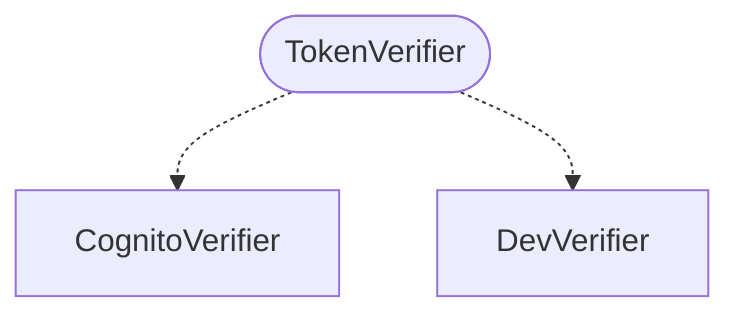

# `TokenVerifier` protocol

Every verifier implementation satisfies the same contract:

- [`CognitoVerifier`](cognito.md) — production. Validates JWTs against a user pool's JWKS.
- [`DevVerifier`](dev.md) — local development. Returns the same user on every call, no validation.

Swap one for the other without changing any call site.

::: openfactcheck.api.auth.protocols
